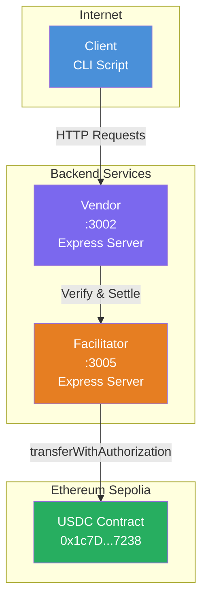
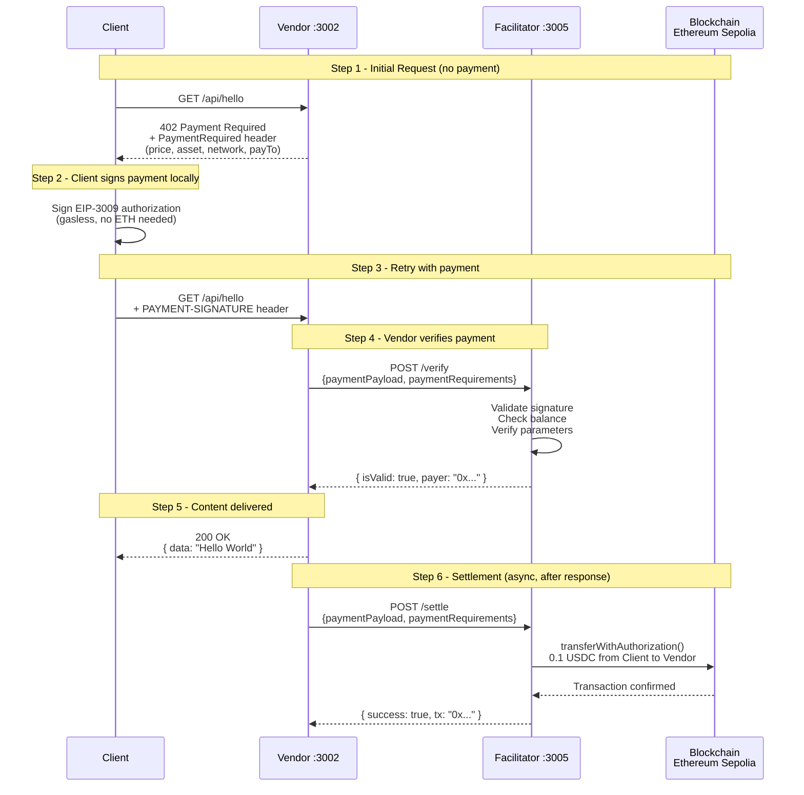
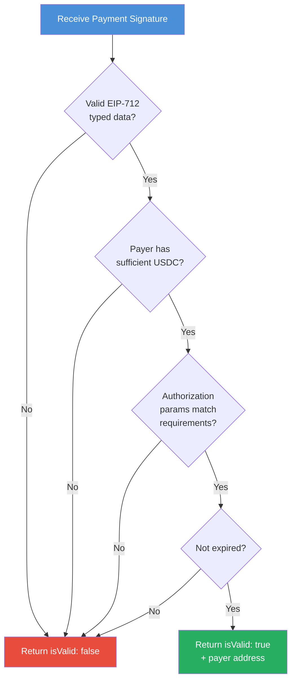
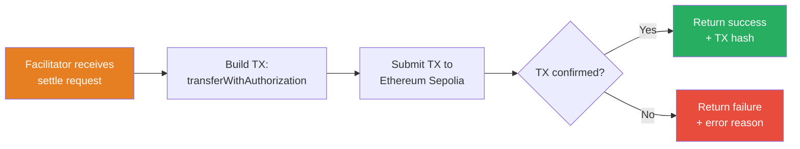
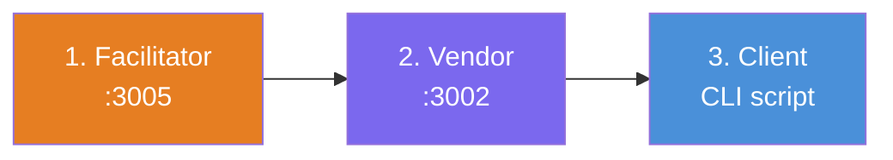
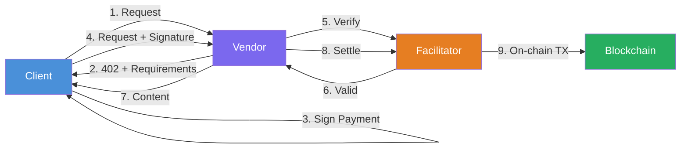

# x402 Demo

A complete demonstration of the [x402 payment protocol](https://x402.org) with Facilitator, Vendor, and Client implementations running on Ethereum Sepolia testnet.

## Architecture Overview


```mermaid
graph TB
    subgraph Internet
        C[Client<br/>CLI Script]
    end

    subgraph Backend Services
        V[Vendor<br/>:3002<br/>Express Server]
        F[Facilitator<br/>:3005<br/>Express Server]
    end

    subgraph Ethereum Sepolia
        BC[USDC Contract<br/>0x1c7D...7238]
    end

    C -->|HTTP Requests| V
    V -->|Verify & Settle| F
    F -->|transferWithAuthorization| BC

    style C fill:#4A90D9,color:#fff
    style V fill:#7B68EE,color:#fff
    style F fill:#E67E22,color:#fff
    style BC fill:#27AE60,color:#fff
```

### Components

| Component | Port | Description |
|-----------|------|-------------|
| **Facilitator** | 3005 | Verifies payment signatures and settles payments on-chain |
| **Vendor** | 3002 | Serves protected content, requires x402 payment |
| **Client** | - | CLI script that makes x402 payments |

## Payment Flow (Sequence Diagram)


```mermaid
sequenceDiagram
    participant C as Client
    participant V as Vendor :3002
    participant F as Facilitator :3005
    participant BC as Blockchain<br/>Ethereum Sepolia

    Note over C,BC: Step 1 - Initial Request (no payment)
    C->>V: GET /api/hello
    V-->>C: 402 Payment Required<br/>+ PaymentRequired header<br/>(price, asset, network, payTo)

    Note over C: Step 2 - Client signs payment locally
    C->>C: Sign EIP-3009 authorization<br/>(gasless, no ETH needed)

    Note over C,BC: Step 3 - Retry with payment
    C->>V: GET /api/hello<br/>+ PAYMENT-SIGNATURE header

    Note over V,F: Step 4 - Vendor verifies payment
    V->>F: POST /verify<br/>{paymentPayload, paymentRequirements}
    F->>F: Validate signature<br/>Check balance<br/>Verify parameters
    F-->>V: { isValid: true, payer: "0x..." }

    Note over C,V: Step 5 - Content delivered
    V-->>C: 200 OK<br/>{ data: "Hello World" }

    Note over V,BC: Step 6 - Settlement (async, after response)
    V->>F: POST /settle<br/>{paymentPayload, paymentRequirements}
    F->>BC: transferWithAuthorization()<br/>0.1 USDC from Client to Vendor
    BC-->>F: Transaction confirmed
    F-->>V: { success: true, tx: "0x..." }
```

## Verification Flow (Detail)


```mermaid
flowchart TD
    A[Receive Payment Signature] --> B{Valid EIP-712<br/>typed data?}
    B -->|No| C[Return isValid: false]
    B -->|Yes| D{Payer has<br/>sufficient USDC?}
    D -->|No| C
    D -->|Yes| E{Authorization<br/>params match<br/>requirements?}
    E -->|No| C
    E -->|Yes| F{Not expired?}
    F -->|No| C
    F -->|Yes| G[Return isValid: true<br/>+ payer address]

    style A fill:#4A90D9,color:#fff
    style C fill:#E74C3C,color:#fff
    style G fill:#27AE60,color:#fff
```

## Settlement Flow (Detail)


```mermaid
flowchart LR
    A[Facilitator receives<br/>settle request] --> B[Build TX:<br/>transferWithAuthorization]
    B --> C[Submit TX to<br/>Ethereum Sepolia]
    C --> D{TX confirmed?}
    D -->|Yes| E[Return success<br/>+ TX hash]
    D -->|No| F[Return failure<br/>+ error reason]

    style A fill:#E67E22,color:#fff
    style E fill:#27AE60,color:#fff
    style F fill:#E74C3C,color:#fff
```

## Prerequisites

1. **Node.js 18+** installed
2. **Testnet wallets** funded on Ethereum Sepolia:

| Wallet | Needs | Why |
|--------|-------|-----|
| **Facilitator** | Sepolia ETH | Pays gas to submit settlement transactions |
| **Client** | Sepolia USDC | Makes payments for protected content |
| **Vendor** | Nothing | Only receives payments |

### Get Testnet Tokens

| Token | Faucet | Notes |
|-------|--------|-------|
| **ETH** | [Alchemy Faucet](https://www.alchemy.com/faucets/ethereum-sepolia) | For Facilitator wallet gas fees |
| **USDC** | [Circle Faucet](https://faucet.circle.com/) | Select **"Ethereum Sepolia"** for Client wallet |

### Demo Wallets (pre-configured)

| Role | Address | Needs |
|------|---------|-------|
| **Facilitator** | `0xd7f794249DA63e4b70a58e59BDD91e1B4247a6f0` | ETH (for gas) |
| **Client** | `0xd24AA0A3000115Ec2Ed17E738e9C74C2CbBc40ec` | USDC (for payments) |
| **Vendor** | `0x30df5A4325C90e1591297175BC06d12d1b981a06` | Nothing (receives payments) |

## Quick Start

### Step 1: Clone and Install Dependencies

```bash
git clone <repo-url>
cd x402-demo

# Install dependencies for each service
cd facilitator && npm install && cd ..
cd vendor && npm install && cd ..
cd client && npm install && cd ..
```

### Step 2: Configure Environment Variables

The demo comes **pre-configured** with test wallets. To use your own, copy the example files and edit them:

```bash
# Facilitator (needs private key for settling transactions on-chain)
cp facilitator/.env.example facilitator/.env
# Edit facilitator/.env -> set EVM_PRIVATE_KEY

# Vendor (needs wallet address to receive payments)
cp vendor/.env.example vendor/.env
# Edit vendor/.env -> set EVM_ADDRESS

# Client (needs private key for signing payments)
cp client/.env.example client/.env
# Edit client/.env -> set EVM_PRIVATE_KEY
```

**Environment variables per service:**

| Service | Variable | Description |
|---------|----------|-------------|
| **Facilitator** | `EVM_PRIVATE_KEY` | Private key of wallet with Sepolia ETH |
| **Facilitator** | `PORT` | Server port (default: `3005`) |
| **Vendor** | `EVM_ADDRESS` | Wallet address to receive USDC payments |
| **Vendor** | `FACILITATOR_URL` | Facilitator URL (default: `http://localhost:3005`) |
| **Vendor** | `PORT` | Server port (default: `3002`) |
| **Client** | `EVM_PRIVATE_KEY` | Private key of wallet with Sepolia USDC |
| **Client** | `VENDOR_URL` | Vendor URL (default: `http://localhost:3002`) |

### Step 3: Start the Facilitator (Terminal 1)

> **Important:** The Facilitator must be running before the Vendor and Client.

```bash
cd facilitator
npm run dev
```

Wait until you see:
```
Server running on http://localhost:3005

Endpoints:
   POST /verify    - Verify payment signature
   POST /settle    - Execute payment on-chain
   GET  /supported - List supported networks
   GET  /health    - Health check

Waiting for requests...
```

### Step 4: Start the Vendor (Terminal 2)

> **Important:** The Vendor must be running before the Client. Open a **new terminal**.

```bash
cd vendor
npm run dev
```

Wait until you see:
```
Server running on http://localhost:3002

Endpoints:
   GET /api/hello  - Protected (0.1 USDC)
   GET /api/info   - Public (free)
   GET /health     - Health check

Waiting for requests...
```

### Step 5: Run the Client (Terminal 3)

> **Important:** Both Facilitator and Vendor must be running first. Open a **new terminal**.

```bash
cd client
npm start
```

### Step 6: Verify the Output

A successful run looks like this:

```
x402 CLIENT - Payment Demo

Client Wallet: 0xd24AA0A3000115Ec2Ed17E738e9C74C2CbBc40ec
Network: Ethereum Sepolia (eip155:11155111)
Vendor URL: http://localhost:3002

Checking initial USDC balance
   Balance: 19.5 USDC

Testing public endpoint (no payment required)
   URL: http://localhost:3002/api/info
   Response: { name: "x402 Demo Vendor", ... }

Making initial request to protected endpoint
   URL: http://localhost:3002/api/hello

Sending request (x402 handles payment automatically)

Request successful - Content received!
   Response: { data: "Hello World", message: "This response was paid for via x402!" }

Payment Settlement Details
   Success: true
   TX Hash: 0xe13e...c489
   Network: eip155:11155111

Checking final USDC balance
   Balance: 19.4 USDC
   Spent: 0.10 USDC

Demo complete!
```

## Startup Order


```mermaid
flowchart LR
    A[1. Facilitator<br/>:3005] --> B[2. Vendor<br/>:3002]
    B --> C[3. Client<br/>CLI script]

    style A fill:#E67E22,color:#fff
    style B fill:#7B68EE,color:#fff
    style C fill:#4A90D9,color:#fff
```

> The **Facilitator** must start first (Vendor depends on it for verify/settle). The **Vendor** must start second (Client sends requests to it). The **Client** runs last.

## Network Configuration

| Parameter | Value |
|-----------|-------|
| **Chain** | Ethereum Sepolia (testnet) |
| **Chain ID** | `11155111` |
| **Network ID** | `eip155:11155111` |
| **Token** | USDC |
| **Token Address** | `0x1c7D4B196Cb0C7B01d743Fbc6116a902379C7238` |
| **Token Decimals** | 6 |
| **Price per request** | 0.1 USDC (100000 atomic units) |

## API Endpoints

### Facilitator (`:3005`)

| Method | Endpoint | Description |
|--------|----------|-------------|
| POST | `/verify` | Verify a payment signature against requirements |
| POST | `/settle` | Execute payment on-chain via `transferWithAuthorization` |
| GET | `/supported` | List supported payment kinds and networks |
| GET | `/health` | Health check |

### Vendor (`:3002`)

| Method | Endpoint | Price | Description |
|--------|----------|-------|-------------|
| GET | `/api/hello` | 0.1 USDC | Protected endpoint - returns greeting |
| GET | `/api/info` | Free | Public endpoint - lists available endpoints |
| GET | `/health` | Free | Health check |

## How x402 Works


```mermaid
flowchart LR
    A[Client] -->|1. Request| B[Vendor]
    B -->|2. 402 + Requirements| A
    A -->|3. Sign Payment| A
    A -->|4. Request + Signature| B
    B -->|5. Verify| C[Facilitator]
    C -->|6. Valid| B
    B -->|7. Content| A
    B -->|8. Settle| C
    C -->|9. On-chain TX| D[Blockchain]

    style A fill:#4A90D9,color:#fff
    style B fill:#7B68EE,color:#fff
    style C fill:#E67E22,color:#fff
    style D fill:#27AE60,color:#fff
```

### Why EIP-3009?

- **Gasless for users**: Client only signs a message, never pays gas
- **Atomic payments**: Payment authorization and content delivery are linked
- **Secure**: Uses EIP-712 typed data signatures (not raw `eth_sign`)
- **Delegated settlement**: Facilitator submits the TX and pays gas on behalf of the system

## Project Structure

```
x402-demo/
├── facilitator/           # Payment processor (Port 3005)
│   ├── src/index.ts       # Express server: /verify, /settle, /supported, /health
│   ├── package.json       # @x402/core, @x402/evm, viem, express
│   ├── tsconfig.json
│   ├── .env               # EVM_PRIVATE_KEY, PORT
│   └── .env.example
├── vendor/                # Resource server (Port 3002)
│   ├── src/index.ts       # Express server: /api/hello (paid), /api/info, /health
│   ├── package.json       # @x402/core, @x402/express, @x402/evm, express
│   ├── tsconfig.json
│   ├── .env               # EVM_ADDRESS, FACILITATOR_URL, PORT
│   └── .env.example
├── client/                # Payment client (CLI)
│   ├── src/index.ts       # Demo script using @x402/fetch
│   ├── package.json       # @x402/core, @x402/evm, @x402/fetch, viem
│   ├── tsconfig.json
│   ├── .env               # EVM_PRIVATE_KEY, VENDOR_URL
│   └── .env.example
├── README.md
├── LICENSE
└── .gitignore
```

## Troubleshooting

### `ECONNREFUSED` error on client

```
Error: fetch failed
  [cause]: AggregateError [ECONNREFUSED]
```

**Cause:** The Vendor (`localhost:3002`) or Facilitator (`localhost:3005`) is not running.

**Fix:** Make sure both servers are started **before** running the client. Check with:
```bash
curl http://localhost:3005/health
curl http://localhost:3002/health
```

### `Insufficient balance` error

```
Insufficient balance for payment (need 0.1 USDC)
```

**Cause:** The Client wallet doesn't have enough Sepolia USDC.

**Fix:** Get testnet USDC from the [Circle Faucet](https://faucet.circle.com/) (select "Ethereum Sepolia").

### Settlement fails

```
[SETTLE] Settlement FAILED
```

**Cause:** The Facilitator wallet doesn't have enough Sepolia ETH to pay for gas.

**Fix:** Get testnet ETH from the [Alchemy Faucet](https://www.alchemy.com/faucets/ethereum-sepolia).

### Port already in use

```
Error: listen EADDRINUSE :::3005
```

**Fix:** Kill the process using that port:
```bash
lsof -ti :3005 | xargs kill -9
```

## Resources

- [x402 Specification](https://github.com/coinbase/x402)
- [x402 Documentation](https://docs.cdp.coinbase.com/x402/welcome)
- [x402.org](https://x402.org)
- [EIP-3009: Transfer With Authorization](https://eips.ethereum.org/EIPS/eip-3009)
- [EIP-712: Typed Data Signing](https://eips.ethereum.org/EIPS/eip-712)
- [Circle USDC Faucet](https://faucet.circle.com/)
- [Alchemy Sepolia Faucet](https://www.alchemy.com/faucets/ethereum-sepolia)

## License

Apache-2.0
