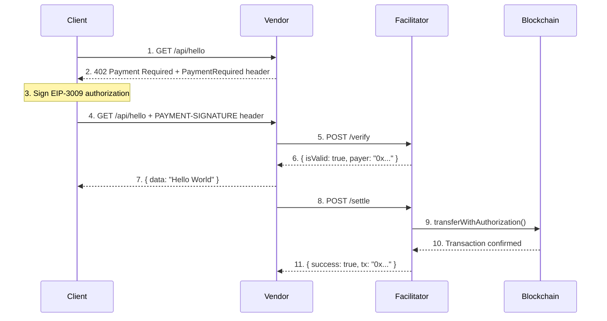
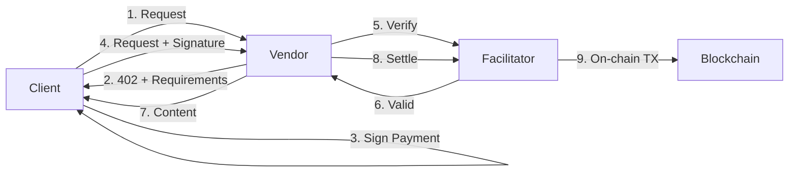

# x402 Demo

A complete demonstration of the [x402 payment protocol](https://x402.org) with Facilitator, Vendor, and Client implementations.

## Architecture



## Components

| Component | Port | Description |
|-----------|------|-------------|
| **Facilitator** | 3005 | Verifies signatures and settles payments on-chain |
| **Vendor** | 3002 | Serves protected content, requires x402 payment |
| **Client** | - | Example script for making x402 payments |

## Demo Wallets (Ethereum Sepolia Testnet)

| Role | Address | Needs |
|------|---------|-------|
| **Facilitator** | `0xd7f794249DA63e4b70a58e59BDD91e1B4247a6f0` | ETH (for gas) |
| **Client** | `0xd24AA0A3000115Ec2Ed17E738e9C74C2CbBc40ec` | USDC (for payments) |
| **Vendor** | `0x30df5A4325C90e1591297175BC06d12d1b981a06` | Nothing (receives payments) |

## Prerequisites

1. Node.js 18+
2. Testnet wallets funded on **Ethereum Sepolia**:
   - **Facilitator wallet**: ETH (for gas to settle transactions)
   - **Client wallet**: USDC (for making payments)

### Get Testnet Tokens (Ethereum Sepolia)

| Token | Faucet |
|-------|--------|
| **ETH** | [Alchemy Faucet](https://www.alchemy.com/faucets/ethereum-sepolia) |
| **USDC** | [Circle Faucet](https://faucet.circle.com/) → Select "Ethereum Sepolia" |

## Quick Start

### 1. Install Dependencies

```bash
# Install all packages
cd facilitator && npm install && cd ..
cd vendor && npm install && cd ..
cd client && npm install && cd ..
```

### 2. Configure Environment

The demo comes pre-configured with test wallets. To use your own:

```bash
# Facilitator (needs private key for settling transactions)
cp facilitator/.env.example facilitator/.env
# Edit: EVM_PRIVATE_KEY

# Vendor (needs wallet address to receive payments)
cp vendor/.env.example vendor/.env
# Edit: EVM_ADDRESS

# Client (needs private key for signing payments)
cp client/.env.example client/.env
# Edit: EVM_PRIVATE_KEY
```

### 3. Run the Demo

```bash
# Terminal 1: Start Facilitator
cd facilitator && npm run dev

# Terminal 2: Start Vendor
cd vendor && npm run dev

# Terminal 3: Run Client
cd client && npm start
```

## Network Configuration

| Parameter | Value |
|-----------|-------|
| **Chain** | Ethereum Sepolia (testnet) |
| **Network ID** | `eip155:11155111` |
| **Token** | USDC |
| **Token Address** | `0x1c7D4B196Cb0C7B01d743Fbc6116a902379C7238` |
| **Price per request** | 0.1 USDC |

## API Endpoints

### Facilitator (`:3005`)

| Method | Endpoint | Description |
|--------|----------|-------------|
| POST | `/verify` | Verify payment signature |
| POST | `/settle` | Execute payment on-chain |
| GET | `/supported` | List supported networks |
| GET | `/health` | Health check |

### Vendor (`:3002`)

| Method | Endpoint | Price | Description |
|--------|----------|-------|-------------|
| GET | `/api/hello` | 0.1 USDC | Protected endpoint |
| GET | `/api/info` | Free | Public endpoint |
| GET | `/health` | Free | Health check |

## How x402 Works



### Payment Flow

1. **Client** requests a protected resource (`GET /api/hello`)
2. **Vendor** responds with `402 Payment Required` + payment requirements
3. **Client** signs an EIP-3009 authorization (gasless signature)
4. **Client** retries the request with the `PAYMENT-SIGNATURE` header
5. **Vendor** asks **Facilitator** to verify the signature
6. **Facilitator** validates signature, balance, and parameters
7. **Vendor** serves the protected content
8. **Vendor** asks **Facilitator** to settle the payment
9. **Facilitator** calls `transferWithAuthorization` on the USDC contract

### Why EIP-3009?

- **Gasless for users**: Client only signs, doesn't pay gas
- **Atomic payments**: Payment and content delivery are linked
- **Secure**: Uses typed data signatures (EIP-712)

## Project Structure

```
x402-demo/
├── facilitator/           # Port 3005
│   ├── src/index.ts       # Express server with verify/settle endpoints
│   ├── package.json
│   └── .env
├── vendor/                # Port 3002
│   ├── src/index.ts       # Express server with x402 middleware
│   ├── package.json
│   └── .env
├── client/                # Payment example
│   ├── src/index.ts       # Demo script using @x402/fetch
│   ├── package.json
│   └── .env
└── frontend/              # (optional UI)
```

## Resources

- [x402 Specification](https://github.com/coinbase/x402)
- [x402 Documentation](https://docs.cdp.coinbase.com/x402/welcome)
- [x402.org](https://x402.org)
- [EIP-3009: Transfer With Authorization](https://eips.ethereum.org/EIPS/eip-3009)
- [Circle USDC Faucet](https://faucet.circle.com/)

## License

Apache-2.0
