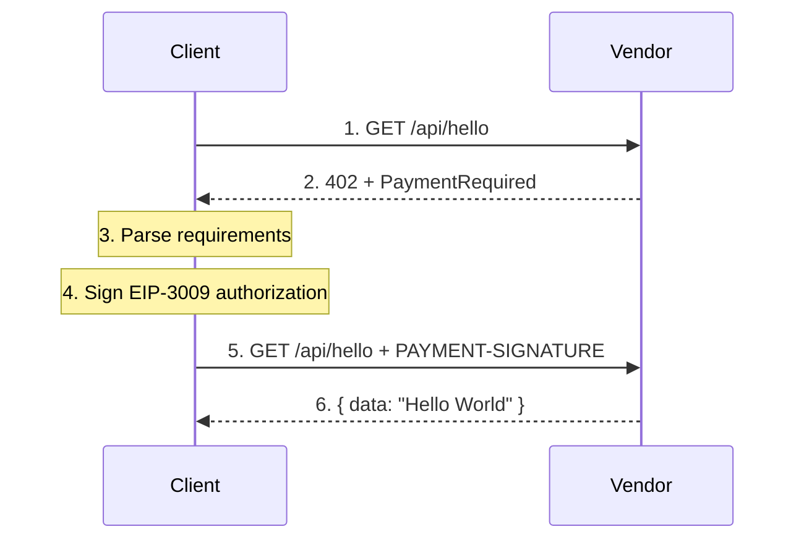

# x402 Client

The Client makes requests to x402-protected endpoints and handles payment automatically.

## Role in x402



## How It Works

### 1. Initial Request

Client makes a normal HTTP request:

```typescript
const response = await fetch("http://localhost:3002/api/hello");
// Returns 402 Payment Required
```

### 2. Parse Payment Requirements

Extract requirements from `PAYMENT-REQUIRED` header:

```json
{
  "x402Version": 2,
  "accepts": [{
    "scheme": "exact",
    "network": "eip155:11155111",
    "asset": "0x1c7D4B196Cb0C7B01d743Fbc6116a902379C7238",
    "amount": "100000",
    "payTo": "0x30df5A4325C90e1591297175BC06d12d1b981a06"
  }]
}
```

### 3. Sign EIP-3009 Authorization

Client signs a gasless transfer authorization:

```typescript
const authorization = {
  from: clientAddress,
  to: payTo,
  value: amount,
  validAfter: now,
  validBefore: now + timeout,
  nonce: randomBytes(32)
};

const signature = await signTypedData(EIP712Domain, authorization);
```

### 4. Retry with Payment

Include signed payment in header:

```typescript
const response = await fetch("http://localhost:3002/api/hello", {
  headers: {
    "PAYMENT-SIGNATURE": base64Encode(paymentPayload)
  }
});
// Returns 200 OK with content
```

## Configuration

```bash
# .env
EVM_PRIVATE_KEY=0x...  # Wallet for signing payments (needs USDC)
VENDOR_URL=http://localhost:3002
```

## Running

```bash
npm install
npm start      # Run payment demo
```

## Wallet Requirements

The Client wallet needs:
- **USDC** on Sepolia for payments
- No ETH needed (gasless signing via EIP-3009)

## Demo Wallet

- **Address:** `0xd24AA0A3000115Ec2Ed17E738e9C74C2CbBc40ec`
- **Needs:** USDC on Ethereum Sepolia

Get testnet USDC: https://faucet.circle.com/ → Select "Ethereum Sepolia"

## Using @x402/fetch

This example uses `@x402/fetch` which wraps `fetch` with automatic payment handling:

```typescript
import { wrapFetchWithPayment, x402Client } from "@x402/fetch";
import { registerExactEvmScheme } from "@x402/evm/exact/client";

const client = new x402Client();
registerExactEvmScheme(client, { signer: evmSigner });

const fetchWithPayment = wrapFetchWithPayment(fetch, client);

// Automatically handles 402 → sign → retry
const response = await fetchWithPayment("http://localhost:3002/api/hello");
```
