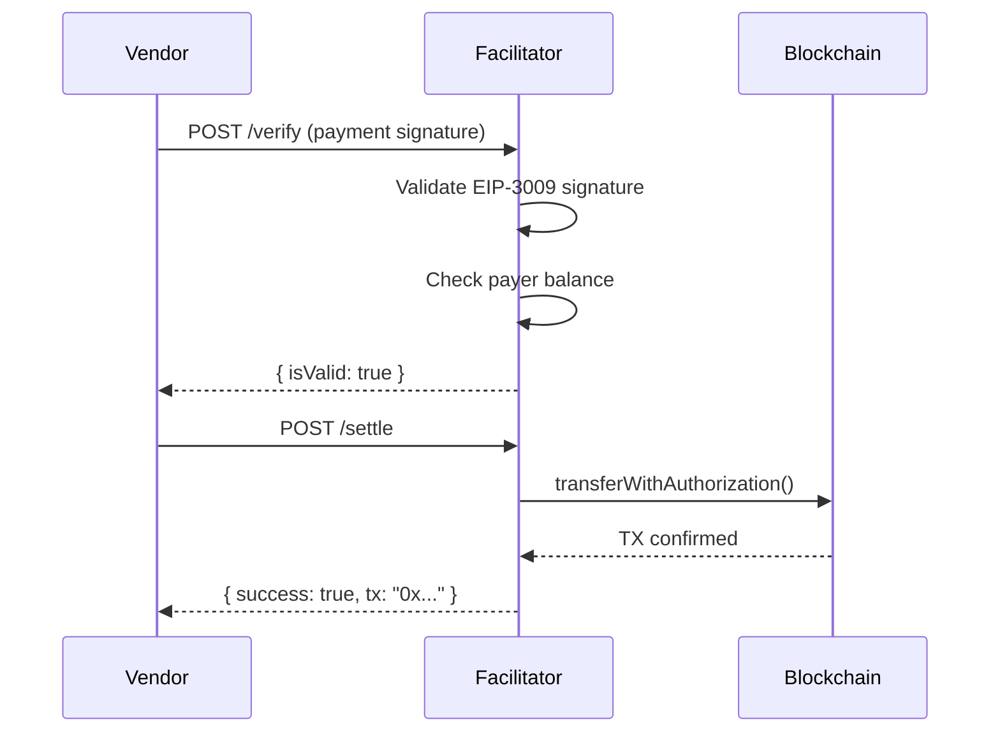

# x402 Facilitator

The Facilitator is the payment processor in the x402 protocol. It verifies payment signatures and settles transactions on-chain.

## Role in x402



## Endpoints

| Method | Path | Description |
|--------|------|-------------|
| POST | `/verify` | Verify payment signature without executing |
| POST | `/settle` | Execute payment on-chain |
| GET | `/supported` | List supported networks/schemes |
| GET | `/health` | Health check |

## Configuration

```bash
# .env
EVM_PRIVATE_KEY=0x...  # Wallet for settling transactions (needs ETH for gas)
PORT=3005
```

## How It Works

### 1. Verify (`POST /verify`)

Receives a payment signature and validates:
- EIP-712 signature is valid
- Payer has sufficient USDC balance
- Authorization parameters match requirements
- Time window is valid

**Does NOT execute any on-chain transaction.**

### 2. Settle (`POST /settle`)

After verification, executes the actual payment:
- Calls `transferWithAuthorization()` on USDC contract
- Uses EIP-3009 gasless transfer
- Returns transaction hash

## Running

```bash
npm install
npm run dev    # Development with hot reload
npm start      # Production
```

## Wallet Requirements

The Facilitator wallet needs:
- **ETH** on Sepolia for gas fees
- No USDC needed (it facilitates transfers, doesn't hold funds)

## Demo Wallet

- **Address:** `0xd7f794249DA63e4b70a58e59BDD91e1B4247a6f0`
- **Needs:** ETH on Ethereum Sepolia

Get testnet ETH: https://www.alchemy.com/faucets/ethereum-sepolia
