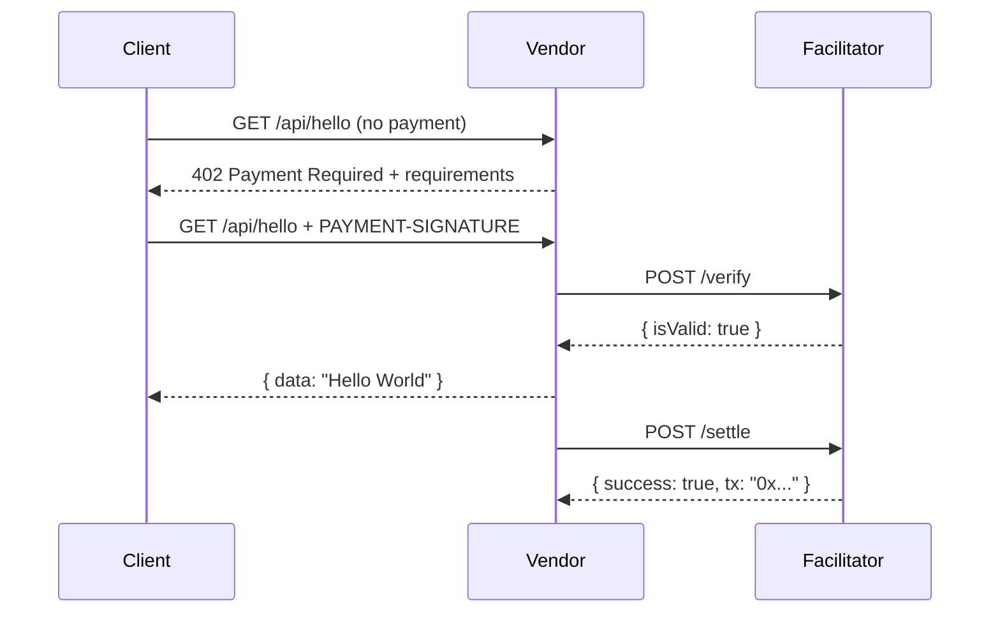

# x402 Vendor (Resource Server)

The Vendor serves protected content that requires payment via the x402 protocol.

## Role in x402



## Endpoints

| Method | Path | Price | Description |
|--------|------|-------|-------------|
| GET | `/api/hello` | 0.1 USDC | Protected endpoint |
| GET | `/api/info` | Free | Public info |
| GET | `/health` | Free | Health check |

## Configuration

```bash
# .env
FACILITATOR_URL=http://localhost:3005
EVM_ADDRESS=0x...  # Wallet to receive payments
PORT=3002
```

## How It Works

### 1. Initial Request (No Payment)

When a client requests `/api/hello` without payment:

```
HTTP/1.1 402 Payment Required
PAYMENT-REQUIRED: <base64-encoded requirements>

{
  "x402Version": 2,
  "accepts": [{
    "scheme": "exact",
    "network": "eip155:11155111",
    "asset": "0x1c7D4B196Cb0C7B01d743Fbc6116a902379C7238",
    "amount": "100000",
    "payTo": "0x..."
  }]
}
```

### 2. Paid Request

When client includes `PAYMENT-SIGNATURE` header:

1. Vendor extracts payment from header
2. Calls Facilitator `/verify` to validate
3. If valid, serves the content
4. Calls Facilitator `/settle` to execute payment

### 3. Response with Settlement

```
HTTP/1.1 200 OK
X-PAYMENT-RESPONSE: <base64-encoded settlement>

{ "data": "Hello World" }
```

## Running

```bash
npm install
npm run dev    # Development with hot reload
npm start      # Production
```

## Wallet Requirements

The Vendor wallet:
- Receives USDC payments
- No ETH needed (doesn't pay gas)

## Demo Wallet

- **Address:** `0x30df5A4325C90e1591297175BC06d12d1b981a06`
- **Receives:** USDC payments from clients
